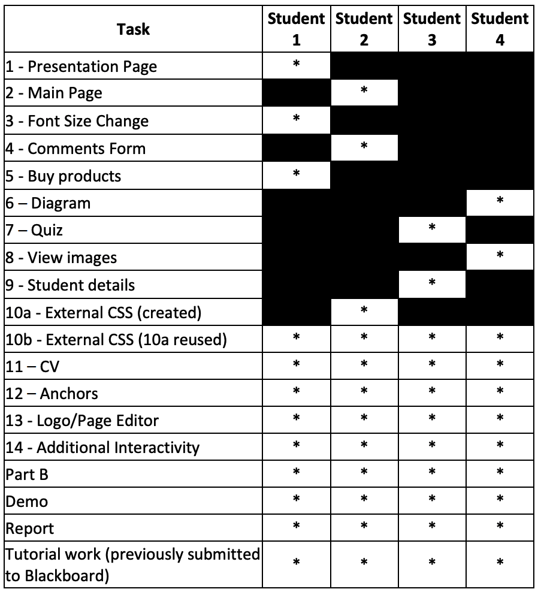

# Web Design & Development Coursework
The official private repository for our Web Design &amp; Development coursework.

## Members

| Member                                                      | Role                       |
| ----------------------------------------------------------- | -------------------------- |
| [Akassharjun Shanmugarajah](https://github.com/akassharjun) | Group Leader & Student One |
| [Dinuka Piyadiyagama](https://github.com/DinDev3)           | Student Two                |
| [Visal Rajapakse](https://github.com/v15a1)                 | Student Three              |
| [Yuwarajalingam Dinesh](http://github.com)                  | Student One                |

## Tasks

## Useful Links
[Coursework Specifications](https://github.com/akassharjun/wdd-coursework/blob/master/assets/coursework-specifications.pdf)

[Snook Colour Contrast Check](https://snook.ca/technical/colour_contrast/colour.html#fg=33FF33,bg=333333)
